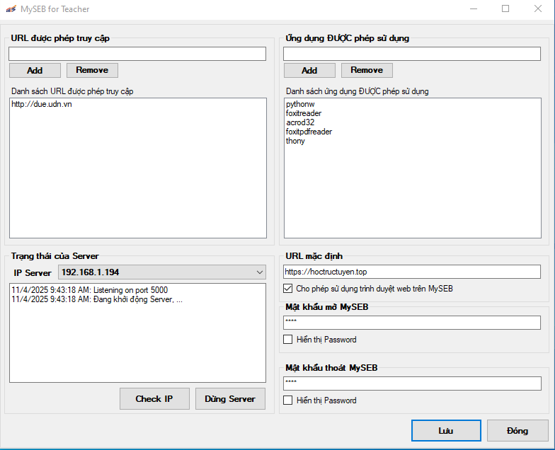

# MySEB - My Safe Exam Browser

**MySEB (My Safe Exam Browser)** là phần mềm hỗ trợ tổ chức thi và kiểm soát môi trường học tập an toàn, giúp **giáo viên** quản lý những phần mềm và trang web mà **người học** được phép sử dụng trong quá trình làm bài hoặc học trực tuyến.  
Phần mềm được phát triển với mục tiêu **ngăn chặn gian lận, đạo văn và sử dụng công cụ AI** trong các kỳ thi trực tuyến, đồng thời đảm bảo tính công bằng và trung thực học thuật.

---

## Mục tiêu

- Tạo môi trường thi, học trực tuyến **an toàn và kiểm soát được**.  
- Hạn chế tối đa việc **sử dụng phần mềm, trang web, hoặc công cụ AI trái phép**.  
- Giúp **giáo viên dễ dàng cấu hình, giám sát và bảo mật phiên thi**.  
- Hỗ trợ **người học truy cập nhanh** vào các tài nguyên được cho phép mà không bị phân tán.

---

## Các phân hệ chính

### 1. Phân hệ Dành cho Giáo viên

Giúp giáo viên thiết lập và kiểm soát toàn bộ môi trường thi/học trực tuyến.

#### Tính năng nổi bật:
- **Cấu hình môi trường thi:**  
  Xác định danh sách phần mềm và trang web mà người học được phép sử dụng.
- **Quản lý truy cập:**  
  Thiết lập **mật khẩu đăng nhập và thoát** để đảm bảo an toàn trong suốt quá trình làm bài.
- **Giám sát hoạt động:**  
  Theo dõi thời gian truy cập, thao tác của người học và phát hiện hành vi bất thường.
- **Tùy chỉnh chính sách:**  
  Lưu và áp dụng nhanh các bộ cấu hình cho từng lớp học, bài kiểm tra hoặc kỳ thi.
- **Báo cáo & nhật ký:**  
  Tự động ghi lại log hoạt động để phục vụ việc đánh giá hoặc tra soát sau kỳ thi.

---

### 2. Phân hệ Dành cho Người học

Giúp người học tham gia vào các phiên thi hoặc học tập trực tuyến trong môi trường được kiểm soát.

#### Tính năng nổi bật:
- **Đăng nhập an toàn:**  
  Người học đăng nhập bằng tài khoản do giáo viên hoặc hệ thống cung cấp.
- **Giới hạn ứng dụng & trang web:**  
  Sau khi đăng nhập, chỉ các phần mềm và trang web được giáo viên cho phép mới có thể mở.
- **Khóa môi trường làm bài:**  
  Ngăn truy cập các phần mềm khác, chặn truy cập hệ thống hoặc công cụ AI trong thời gian thi.
- **Tự động lưu & bảo mật:**  
  Bài làm và dữ liệu thi được lưu trữ an toàn, tránh mất dữ liệu hoặc can thiệp trái phép.

---

## Lợi ích nổi bật

- **Tăng tính trung thực** trong học tập và thi cử.  
- **Ngăn chặn sử dụng AI** hoặc công cụ gian lận khác.  
- **Tùy chỉnh linh hoạt** cho từng môn học, lớp học hoặc kỳ thi.  
- **Báo cáo chi tiết**, dễ dàng tích hợp với hệ thống LMS (Moodle, Canvas, v.v.).

---

## Giấy phép sử dụng

Phần mềm **MySEB** được phát triển với mục tiêu phục vụ giáo dục, tuân thủ các quy định về bảo mật và quyền riêng tư người dùng.  

---

## Nhóm phát triển

- **Liên hệ:** thuynt@due.edu.vn
- **Đóng góp:** Mọi đề xuất, báo lỗi hoặc đóng góp đều được hoan nghênh thông qua [GitHub Issues].

---

## Một số màn hình của ứng dụng

### Phân hệ dành cho giáo viên

  

